# 🛒 E-Commerce Order Management System

> **A recruiter-ready MySQL 8.0 database project demonstrating real-world e-commerce data management, relational design, SQL querying, analytics, and advanced SQL techniques.**


---

## 📌 Project Overview

The **E-Commerce Order Management System** is a relational database project built with **MySQL 8.0**.

It models a small e-commerce business and manages:

- 👤 Customers
- 📦 Products
- 🗂️ Product Categories
- 🛍️ Orders
- 🧾 Order Items
- 💳 Payments
- 🚚 Shipping

The project goes beyond basic table creation by applying **CRUD operations, primary/foreign keys, joins, filtering, sorting, grouping, aggregate functions, subqueries, CASE expressions, date/time functions, string functions, and window functions**.

The SQL work is saved in `ecommerce_db.sql`.

---

## 🎯 Project Objectives

- 🏗️ Design a normalized relational database structure.
- 🔗 Connect related entities using primary and foreign keys.
- ✏️ Perform INSERT, UPDATE, and DELETE operations.
- 🔍 Retrieve meaningful business information with SQL queries.
- 📊 Analyze sales, orders, customers, products, and revenue.
- 🧠 Demonstrate intermediate and advanced SQL concepts.
- 📈 Generate business-oriented insights from transactional data.

---

## 🧰 Technology Stack

| Technology | Purpose |
|---|---|
| 🐬 MySQL 8.0 | Database management system |
| 📝 SQL | Database creation, manipulation & analysis |
| 💻 MySQL Command Line Client | Query execution |
| 📁 `.sql` | Project/database script |
| 📸 Screenshots | Query execution evidence |

---

# 🗺️ Project Flow Chart

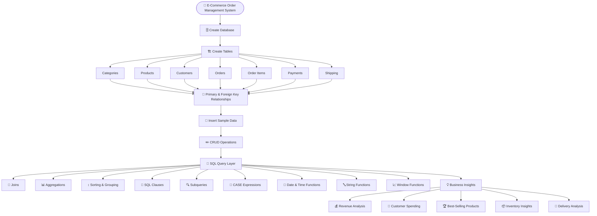

---

# 🗃️ Database Structure

The project contains **7 main tables**:

```text
Categories
    │
    └──< Products
            │
            └──< Order_Items >── Orders >── Customers
                                  │
                                  ├── Payments
                                  │
                                  └── Shipping
```

### 🔑 Main Relationships

- `Categories.category_id` → `Products.category_id`
- `Customers.customer_id` → `Orders.customer_id`
- `Orders.order_id` → `Order_Items.order_id`
- `Products.product_id` → `Order_Items.product_id`
- `Orders.order_id` → `Payments.order_id`
- `Orders.order_id` → `Shipping.order_id`

The SQL script defines primary keys and foreign keys for these relationships. fileciteturn0file0L11-L24 fileciteturn0file0L28-L55 fileciteturn0file0L59-L85

---

# 📋 Core Tables

| Table | Purpose |
|---|---|
| 🗂️ `Categories` | Stores product categories |
| 📦 `Products` | Stores product information, prices and stock |
| 👤 `Customers` | Stores customer details |
| 🛍️ `Orders` | Stores customer orders and order status |
| 🧾 `Order_Items` | Stores products and quantities inside orders |
| 💳 `Payments` | Stores payment details and status |
| 🚚 `Shipping` | Stores shipping and delivery information |

The database is created as `ecommerce_db` and selected before the tables are created. fileciteturn0file0L6-L10

---

# ⚙️ SQL Concepts Demonstrated

## 🔐 1. Primary Keys & Foreign Keys

The project uses primary keys to uniquely identify records and foreign keys to maintain relationships between tables.

Example relationship:

```sql
FOREIGN KEY (customer_id)
REFERENCES Customers(customer_id)
```

Screenshot:

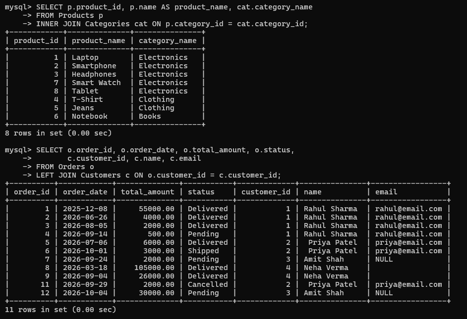

---

## ✏️ 2. CRUD Operations

The project demonstrates database manipulation through:

- ➕ `INSERT`
- 🔎 `SELECT`
- ✏️ `UPDATE`
- 🗑️ `DELETE`

The script includes product/customer insertion, an order transaction, a stock update, and deletion of an old cancelled order. fileciteturn0file0L161-L188

Screenshot:

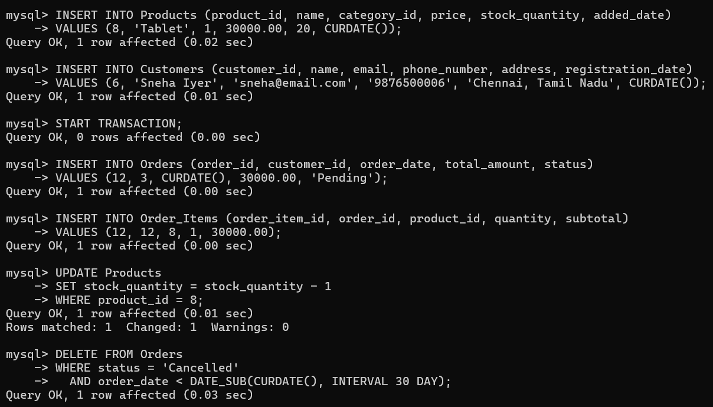

---

## 🔢 3. SQL Operators

Filtering and logical conditions are used to retrieve specific records.

Examples include:

```sql
WHERE NOT (stock_quantity = 0);
```

```sql
WHERE status <> 'Cancelled';
```

Screenshot:

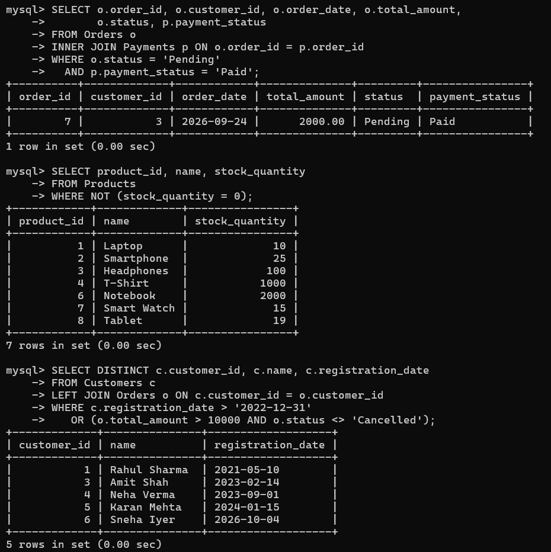

---

## 🔗 4. SQL Joins

The project demonstrates relational data retrieval using joins such as:

- `INNER JOIN`
- `LEFT JOIN`
- `RIGHT JOIN`
- `UNION`-based full-join style logic

Example:

```sql
SELECT p.product_id, p.name, cat.category_name
FROM Products p
INNER JOIN Categories cat
    ON p.category_id = cat.category_id;
```

The project also uses joins to combine orders with customers and payments with orders. fileciteturn0file0L379-L413

Screenshots:

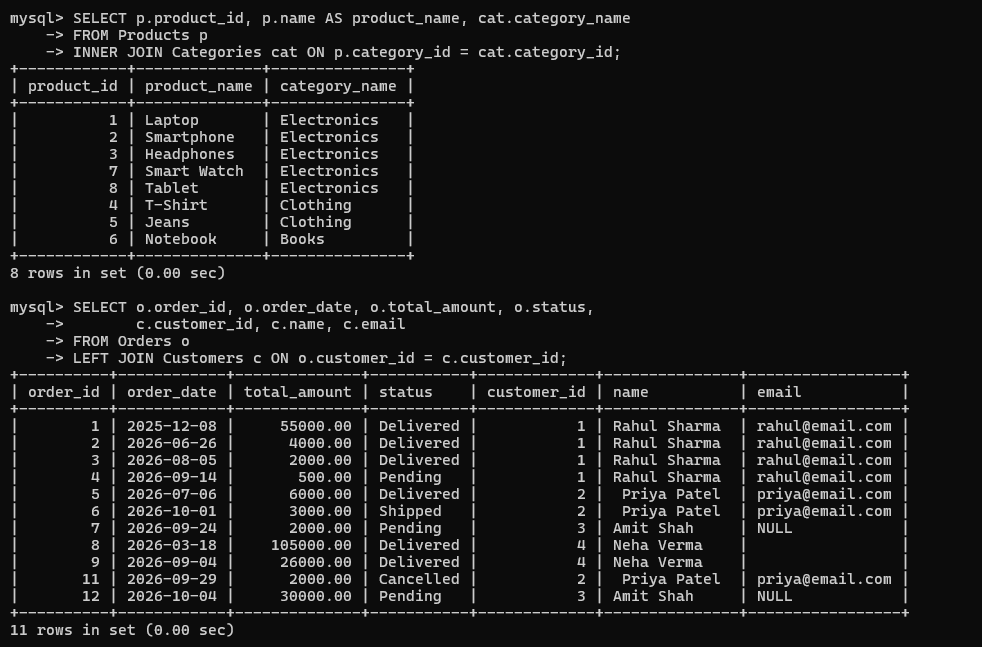

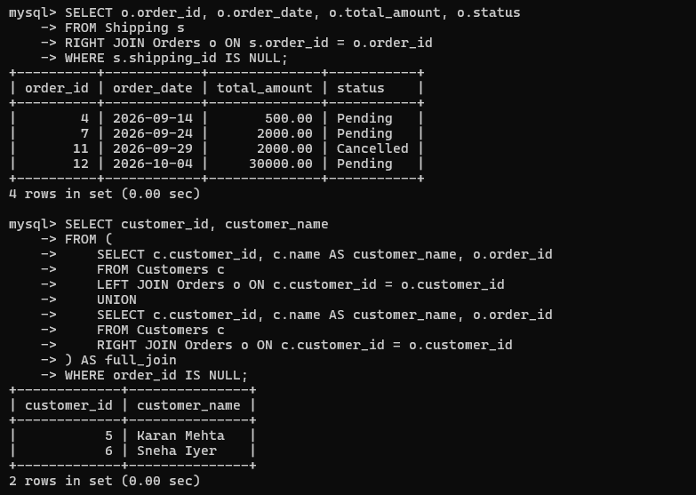

---

## ↕️ 5. Sorting & Grouping

The project uses:

- `ORDER BY`
- `GROUP BY`
- `HAVING`
- `LIMIT`

Example:

```sql
SELECT c.customer_id, c.name,
       COUNT(o.order_id) AS total_orders
FROM Customers c
INNER JOIN Orders o
    ON c.customer_id = o.customer_id
GROUP BY c.customer_id, c.name
HAVING COUNT(o.order_id) > 3;
```

Screenshot:

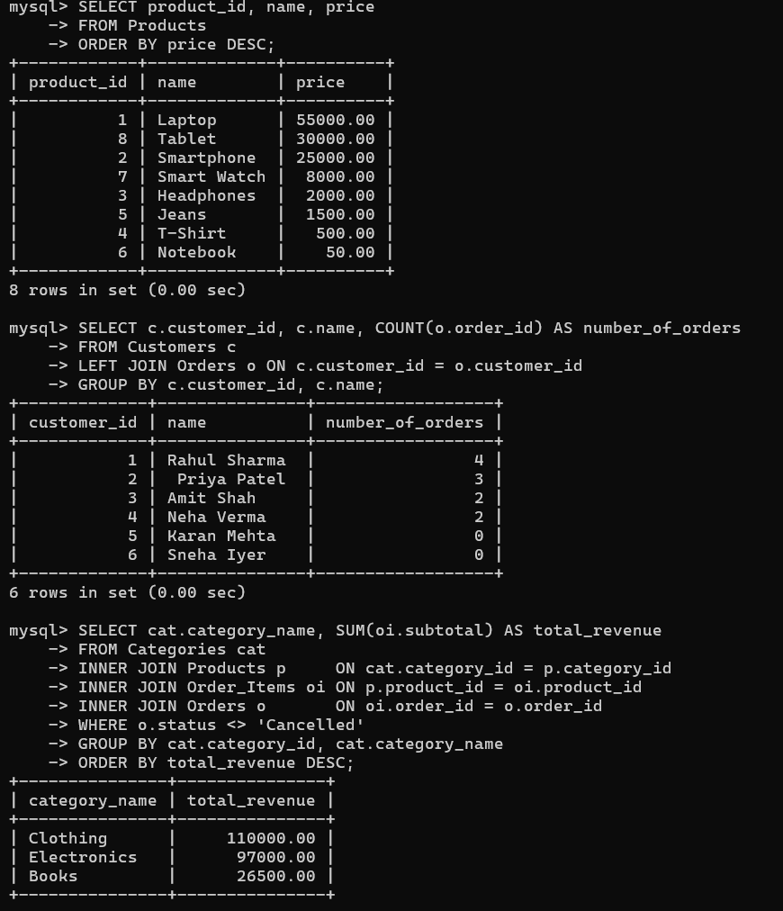

---

## 📊 6. Aggregate Functions

The project uses:

- `SUM()`
- `AVG()`
- `COUNT()`
- `MAX()`
- `MIN()`

Example:

```sql
SELECT COUNT(*) AS number_of_orders,
       MAX(total_amount) AS biggest_order,
       MIN(total_amount) AS smallest_order
FROM Orders
WHERE status <> 'Cancelled';
```

The executed result contains 10 non-cancelled orders, with a biggest order of `105000.00` and smallest order of `500.00`. fileciteturn0file0L367-L376

Screenshot:

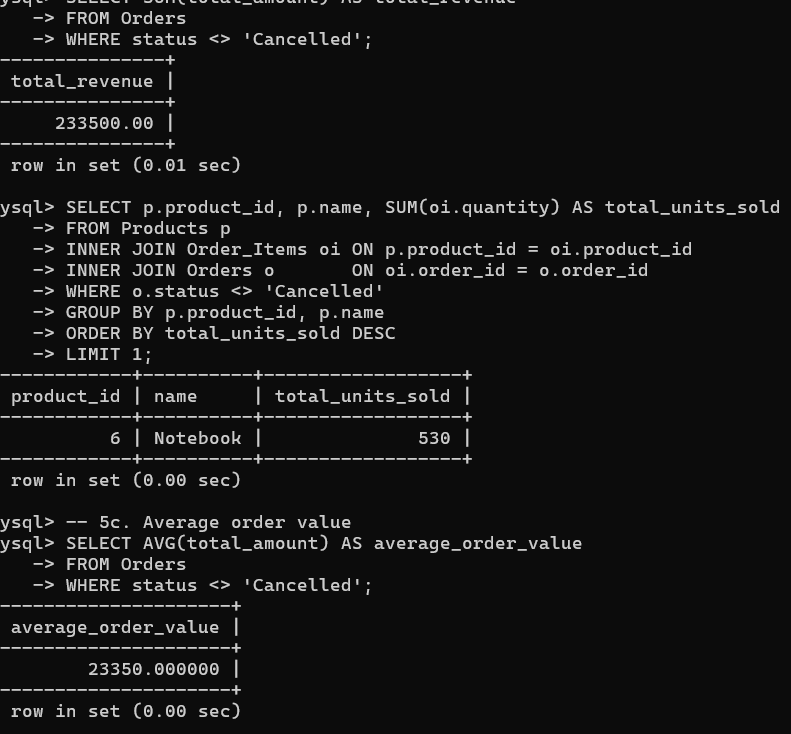

---

## 🧩 7. SQL Clauses

The project applies clauses such as:

```text
SELECT
FROM
WHERE
GROUP BY
HAVING
ORDER BY
LIMIT
```

These clauses are combined to build practical business queries.

Screenshot:

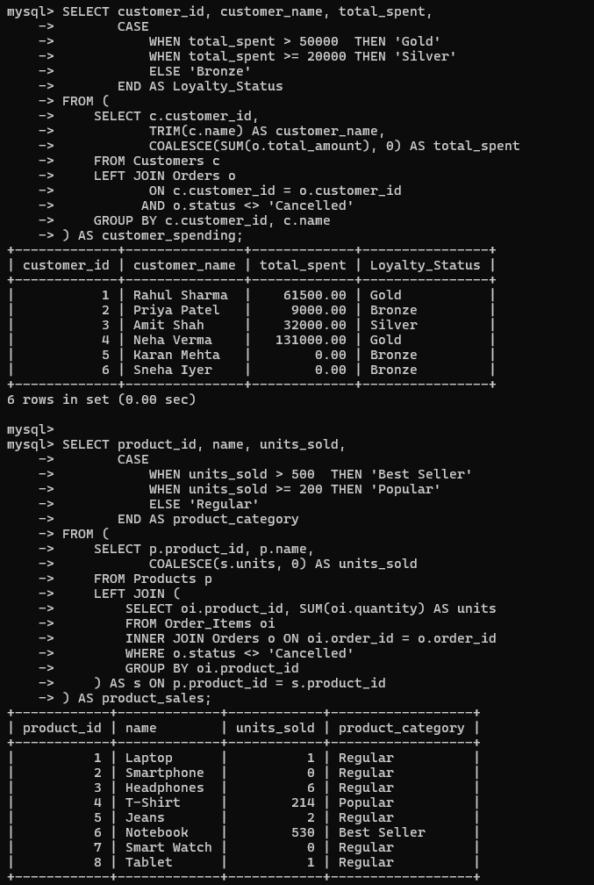

---

## 🔍 8. Subqueries

Subqueries are used for tasks such as:

- Finding orders belonging to customers registered after a specific date.
- Finding the highest-spending customer.
- Finding products that have not appeared in `Order_Items`.

Example:

```sql
SELECT product_id, name
FROM Products
WHERE product_id NOT IN (
    SELECT product_id
    FROM Order_Items
);
```

The query identifies `Smartphone` and `Smart Watch` as products with no order-item record. fileciteturn0file0L484-L495

Screenshot:

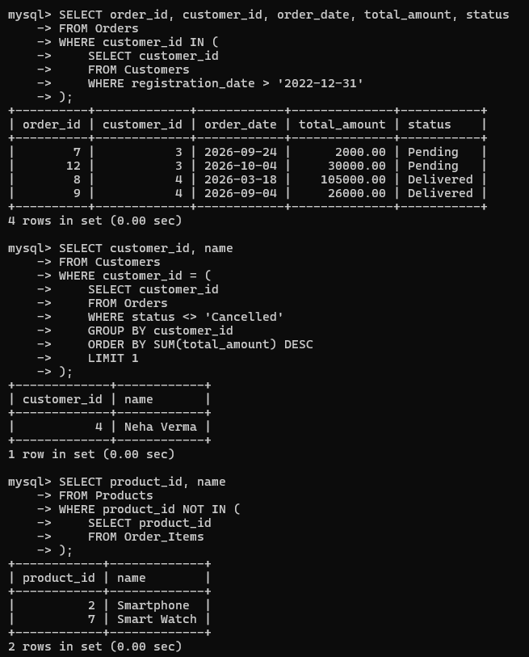

---

## 🧠 9. CASE Expressions

The project converts numeric business values into useful categories.

### Customer Loyalty

```sql
CASE
    WHEN total_spent > 50000 THEN 'Gold'
    WHEN total_spent >= 20000 THEN 'Silver'
    ELSE 'Bronze'
END
```

### Product Category

```sql
CASE
    WHEN units_sold > 500 THEN 'Best Seller'
    WHEN units_sold >= 200 THEN 'Popular'
    ELSE 'Regular'
END
```

The executed results classify customers into Gold/Silver/Bronze and products into Best Seller/Popular/Regular. fileciteturn0file0L665-L724

Screenshot:


---

## 📅 10. Date & Time Functions

The project uses MySQL date functions including:

- `CURDATE()`
- `DATE_SUB()`
- `YEAR()`
- `MONTH()`
- `DATEDIFF()`
- `DATE_FORMAT()`

Example:

```sql
SELECT order_id,
       shipping_date,
       delivery_date,
       DATEDIFF(delivery_date, shipping_date) AS delivery_days
FROM Shipping
WHERE delivery_date IS NOT NULL;
```

The executed query calculates delivery durations for completed shipments. fileciteturn0file0L517-L530

Screenshot:

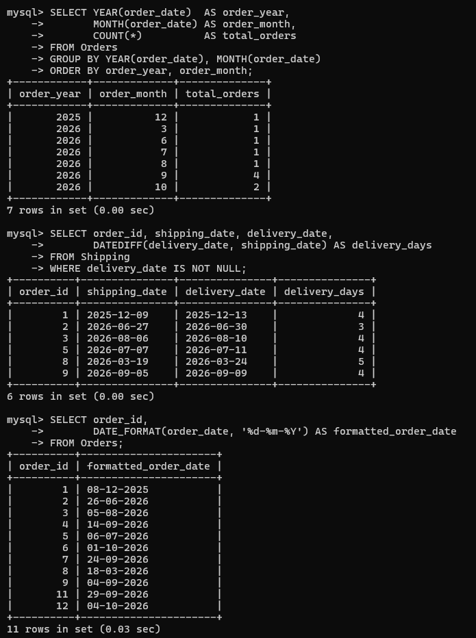

---

## 🔤 11. String Functions

The project uses:

- `UPPER()`
- `TRIM()`
- `NULLIF()`
- `COALESCE()`

Example:

```sql
SELECT customer_id,
       TRIM(name) AS customer_name,
       COALESCE(NULLIF(TRIM(email), ''), 'Not Provided') AS email
FROM Customers;
```

This query cleans customer names and converts missing/blank emails into `Not Provided`. fileciteturn0file0L569-L595

Screenshot:

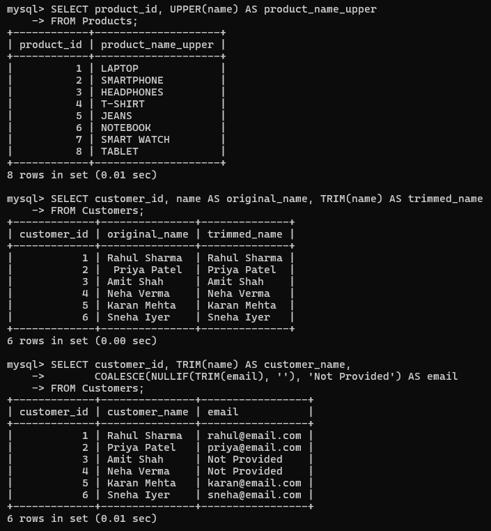

---

## 📈 12. Window Functions

The project demonstrates advanced SQL analytics with:

- `RANK() OVER()`
- `SUM() OVER()`
- `COUNT() OVER()`

Example:

```sql
RANK() OVER (
    ORDER BY COALESCE(SUM(o.total_amount), 0) DESC
) AS spending_rank
```

The project also calculates cumulative monthly revenue and a running order count. fileciteturn0file0L598-L661

Screenshot:

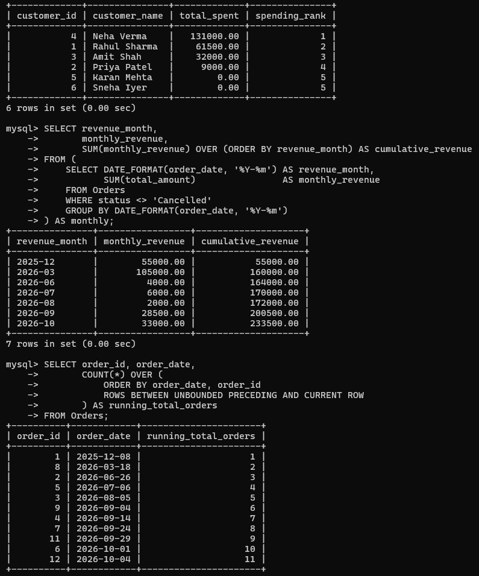

---

# 📊 Business Insights Demonstrated

The queries produce useful e-commerce insights.

| 📌 Metric | Result |
|---|---:|
| 💰 Total non-cancelled revenue | **233,500.00** |
| 🏆 Highest-spending customer | **Neha Verma — 131,000.00** |
| 🥇 Best-selling product | **Notebook — 530 units** |
| 📦 Highest-revenue category | **Clothing — 110,000.00** |
| 🧾 Average order value | **23,350.00** |
| 💸 Largest non-cancelled order | **105,000.00** |
| 👤 Customer with >3 orders | **Rahul Sharma — 4 orders** |

These values are directly supported by the executed SQL results in the project file. fileciteturn0file0L314-L337 fileciteturn0file0L341-L375 fileciteturn0file0L467-L480

---

# 🧪 Sample Query

```sql
SELECT c.customer_id,
       TRIM(c.name) AS customer_name,
       COALESCE(SUM(o.total_amount), 0) AS total_spent,
       RANK() OVER (
           ORDER BY COALESCE(SUM(o.total_amount), 0) DESC
       ) AS spending_rank
FROM Customers c
LEFT JOIN Orders o
       ON c.customer_id = o.customer_id
      AND o.status <> 'Cancelled'
GROUP BY c.customer_id, c.name;
```

### Result

```text
Neha Verma   → 131000.00 → Rank 1
Rahul Sharma →  61500.00 → Rank 2
Amit Shah    →  32000.00 → Rank 3
Priya Patel  →   9000.00 → Rank 4
```

---

# 📸 Project Screenshots

All screenshots are organized in the `Screenshots/` directory.

### Database & CRUD


### Querying & Joins


### Data Analysis


### Advanced SQL


---

# 📁 Recommended Repository Structure

```text
E-Commerce-Order-Management-System/
│
├── 📄 ecommerce_db.sql
├── 📄 README.md
│
└── 📁 Screenshots/
    ├── 01_primary_and_foreign_keys.png
    ├── 02_crud_operations.png
    ├── 03_sql_operators.png
    ├── 04_joins_a.png
    ├── 05_joins_b.png
    ├── 06_sorting_and_grouping.png
    ├── 07_aggregate_functions.png
    ├── 08_sql_clauses.png
    ├── 09_subqueries.png
    ├── 10_case_expression.png
    ├── 11_date_time_functions.png
    ├── 12_string_functions.png
    └── 13_window_functions.png
```

---

# ▶️ How to Run the Project

### 1️⃣ Open MySQL 8.0

Start the MySQL server and open the MySQL Command Line Client.

### 2️⃣ Run the SQL file

```sql
SOURCE path/to/ecommerce_db.sql;
```

### 3️⃣ Select the database

```sql
USE ecommerce_db;
```

### 4️⃣ Verify the tables

```sql
SHOW TABLES;
```

### 5️⃣ Run the queries

Execute the analysis queries included in the SQL script.

---

# 💼 Skills Demonstrated

This project demonstrates practical knowledge of:

```text
🐬 MySQL 8.0
🗃️ Relational Database Design
🔑 Primary & Foreign Keys
✏️ CRUD Operations
🔗 SQL Joins
📊 Aggregate Functions
↕️ GROUP BY / HAVING / ORDER BY
🔍 Subqueries
🧠 CASE Expressions
📅 Date & Time Functions
🔤 String Manipulation
📈 Window Functions
💰 Business Analytics
🧹 Data Cleaning
📦 Inventory Analysis
👥 Customer Analysis
```

---

# 🚀 Future Improvements

Possible next steps for the project:

- 📊 Build a dashboard using Power BI/Tableau.
- 🔐 Add database user roles and permissions.
- ⚡ Add indexes for frequently queried columns.
- 📈 Add more sales and customer KPIs.
- 🧾 Add stored procedures for common operations.
- 🔔 Add triggers for stock and order-status automation.
- 🌐 Connect the database to a web application.

---

# 👨‍💻 Author

**Dev Gajdhar**

🎓 B.Tech — Artificial Intelligence & Machine Learning  
💻 Interested in SQL, Python, Data Analytics & AI/ML

---

## ⭐ Project Highlights

> **Designed a relational e-commerce database in MySQL 8.0 and performed practical business analysis using advanced SQL queries.**

If you find this project useful, feel free to ⭐ the repository!

---

### 📌 Repository Note

The `ecommerce_db.sql` file contains the database setup, sample data, transactions, CRUD operations, and analytical SQL queries used in this project. fileciteturn0file0L88-L188
